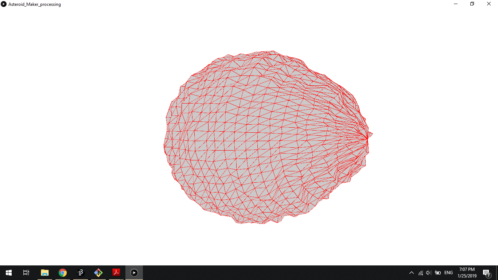

# Asteroid_Maker_processing

The asteroid maker creates randomly generated asteroids using meshes. In this repo, I am using the Java Processing to develop the code for generating since it is easier for visualization and since it is in java, it is much easier to transfer it to C-sharp in Unity. ~~Please see the Wiki page for more details~~. 

### Development History:

Here are some of the results over time...

##### First Realistic try... 

##### More refined but still looks like potato...

##### Getting Somewhere...

##### With some tweaks there is possibility to make "crystal like shapes" too:  

